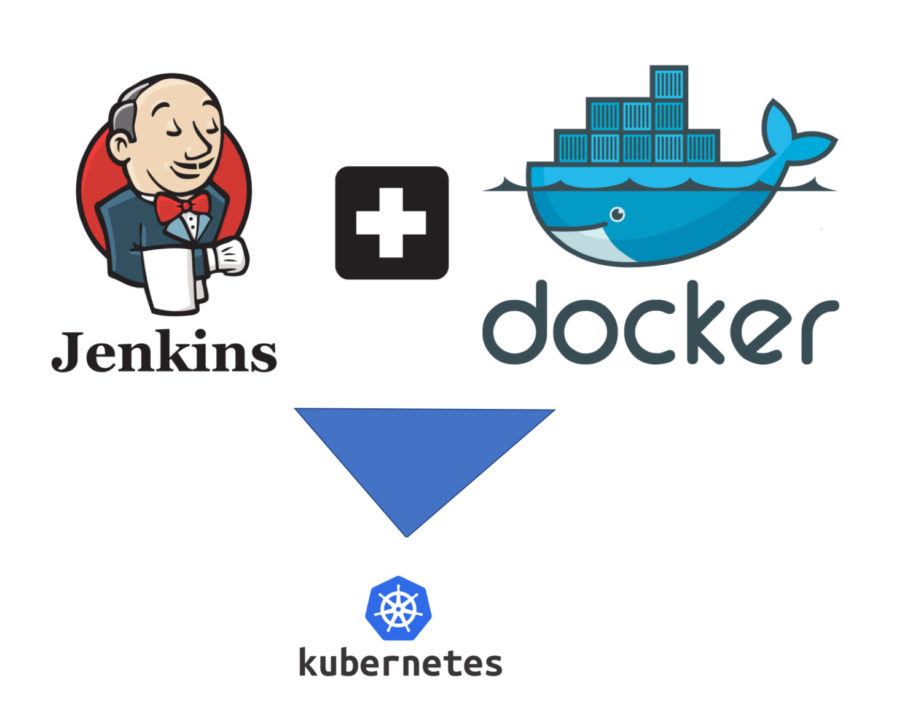

JENKINS + DOCKER (DIND) + KUBECTL
========================

## Criação de Imagem Jenkins com Docker dind e Kubectl Built in 

Neste projeto foi criado uma imagem do Jenkins com suporte a docker in docker (dind) e suporte ao kubernetes através do kubectl.

As modificações necessárias para a criação desta imagem estão no arquivo Dockerfile.

Os arquivos declarativos se encarregam de fazer todos os passos necessários para subir o ambiente completo.

O próprio docker-compose.yml se encarrega de buildar a imagem que está no Dockerfile e subir o ambiente.

Requisitos
------------

- Docker (incluindo docker-compose)
  

Execução
-------------------

Subindo o ambiente do Jenkins:  

    $ docker-compose up -d

Parando o ambiente:

    $ docker-compose stop

Removendo o ambiente:

    $ docker-compose down

Informações do Autor
------------------

- Este projeto foi criado por Willdimark Ragazzi Ventura, DevOps Engineer. (<fininho.cetec@gmail.com>)
- Linkedin [Perfil](https://www.linkedin.com/in/willdymark-ragazzi-ventura-ccna-devnetsecops-membro-anppd%C2%AE-a4422617//).

